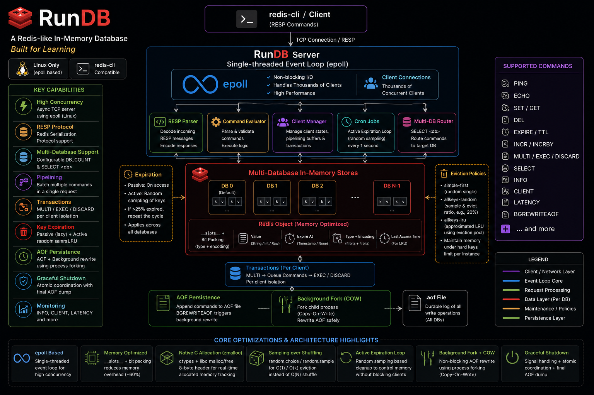

# RunDB

[](https://github.com/DarshanAguru/runDB/releases)
[](LICENSE)
[](#prerequisites)

> [!NOTE]
> **RunDB** is a learning-focused project created to explore and understand Redis internals in simpler terms. It is intended for educational purposes and is not meant to be a production database replacement.

> [!IMPORTANT]
> **Linux-Only**: Since the high-concurrency asynchronous network engine is built using the Linux-specific `select.epoll` API, `RunDB` is compatible with **Linux environments only**.

A lightweight, simplified implementation of a Redis-like in-memory Key-Value store. It demonstrates core concepts such as the Redis Serialization Protocol (RESP), high-concurrency asynchronous networking with `epoll`, and internal memory-management strategies.



## Learning Objectives

This project was built to gain hands-on experience with:

- **RESP Protocol**: Implementing the logic to parse and generate Redis-compatible messages.
- **Asynchronous I/O**: Understanding how `epoll` enables a single-threaded server to handle thousands of concurrent clients.
- **Snapshotting**: Implementing point-in-time data dumps using Append Only Files (AOF).
- **Background Maintenance**: Learning how to use process forking for non-blocking maintenance tasks like AOF rewriting/dumping.
- **Data Eviction & Expiration**: Learning how Redis manages memory and cleans up stale keys using active and passive strategies.
- **Memory Optimization**: Using Python `__slots__` and bit-packing (packing type/encoding into a single byte) to minimize memory overhead per object.
- **Concurrency**: Handling multiple connections in an asynchronous event loop environment.

## Features

- **RESP Support**: Fully compatible with the Redis Serialization Protocol.
- **Asynchronous Server**: High-concurrency TCP server utilizing Linux's `select.epoll` in a non-blocking single-threaded event loop.
- **Multi-Database Support**: Supports configuration of multiple isolated databases via `DB_COUNT` in `config.py` and client routing using the standard `SELECT <db>` command.
- **AOF Snapshotting**: Manually triggerable point-in-time state dumps to an AOF file, fully restoring the states across all active databases.
- **Background Forking**: Non-blocking AOF dumping using `multiprocessing` forking.
- **Pipelining**: Support for batching multiple commands in a single network request.
- **Command Set**: Supports core Redis commands like `PING`, `SET`, `GET`, `DEL`, `EXPIRE`, `TTL`, `INCR`, `INFO`, `CLIENT`, `LATENCY`, `SELECT`, `BGREWRITEAOF`, `LPUSH`, `RPUSH`, `LPOP`, `RPOP`, `LLEN`, `LINDEX`, `LRANGE`, `SADD`, `SISMEMBER`, `SCARD`, `SMEMBERS`, `SRANDMEMBER`, `SREM`, and `DEBUG OBJECT`.
- **Memory Optimized**: Uses a custom open-addressing C-heap `HashMap` for database key-value storage and active key expirations. Uses `__slots__` and bit-packed metadata (4-bit type, 4-bit encoding) to store data efficiently. Includes support for memory-efficient Redis-style list structures via `QuickList`/`ZipList` and set structures via `Intset`/`HashTable`.
- **Type Awareness**: Automatically deduces and stores object types (`STRING`) and encodings (`INT`, `EMBSTR`, `RAW`).
- **Key Expiration**: Passive (lazy) deletion on access and active expiration strategies (random sampling) to clean up stale data across all stores.
- **Graceful Shutdown**: Traps OS termination signals, coordinates with active request executors atomically, and triggers a final AOF persistence dump before exiting cleanly.
- **Redis Transactions**: Full transaction support with `MULTI`, `EXEC`, and `DISCARD` executing queued commands isolated per client connection.
- **Eviction Policies**: Memory reclamation strategies to maintain a hard keys limit:
  - `simple-first`: Evicts a single random key when the memory limit is reached.
  - `allkeys-random`: Evicts a configurable ratio (e.g., 20%) of random keys in the database using high-performance sample selection.
  - `allkeys-lru`: Approximated Least Recently Used eviction strategy utilizing a globally managed, sorted eviction pool similar to Redis.

## Core Optimizations & Architecture

### 1. Memory Optimization & Custom C-Heap Storage

To minimize the memory footprint of storing millions of keys in-memory, `RunDB` bypasses Python's high container overhead and uses custom native C memory management:

- **Native C-Heap HashMap**: The core key-value storage and active expiration lists do not use Python's built-in dictionaries. Instead, they are powered by a custom open-addressing Hash Map built directly on the C heap using FNV-1a hashing and tombstone-based deletion.
  - Storing 50,000 keys takes just **1.79 seconds** to populate.
  - Verified average native C-heap memory consumption is only **~108.5 bytes per key**.
  - Verified process resident set size (RSS) overhead is only **~174.3 bytes per key**.
- **`__slots__` and Ownership Transfer**: By defining `__slots__ = ["_struct_ptr", "_finalizer"]` on our `RedisObject` class, we disable the automatic creation of dynamic instance dictionaries (`__dict__`). When keys are inserted into the store, ownership of the C-allocated struct is transferred completely to the database engine by detaching Python GC finalizers, avoiding double-free issues and preventing Python reference counting overhead.
- **Bit-Packed Type/Encoding**: Instead of storing the object type and encoding as separate integer attributes (which consume 28 bytes each in Python), they are bit-packed into a single 8-bit integer field (`typeEncoding`).
  - High 4 bits: Redis Object Type (e.g., `TYPE_STRING = 0`)
  - Low 4 bits: Redis Object Encoding (e.g., `RAW = 0`, `INT = 1`, `EMBSTR = 8`)
  - Bit-packing formula: `((type & 0x0F) << 4) | (encoding & 0x0F)`
- **Native C Allocation (`zmalloc`)**: To bypass Python's high object memory overhead and simulate actual C-level structures, `RunDB` implements a Redis-style native allocation subsystem via `ctypes`.
  - It binds directly to `libc.malloc()` and `libc.free()`, prepending an 8-byte prefix size header to each allocated block.
  - Real-time allocated memory bytes are tracked in constant time by querying the prefix size header.
  - In Linux environments, native allocations can be powered by `jemalloc` (located in the `./dll/` directory) by starting the server with preloading, ensuring low memory fragmentation just like real Redis.

### 2. High-Performance Eviction Strategy

- **Sampling over Shuffling**: Dict key retrieval in Python preserves insertion order. To select a random key for eviction, a naive approach would shuffle the entire key list using `random.shuffle()`, which incurs a highly inefficient `O(N)` operation for shuffling all keys.
- `RunDB` solves this with ultra-fast sampling methods:
  - For `simple-first`, it uses `random.choice(list(store.keys()))` to instantly locate and evict a single random key.
  - For `allkeys-random`, it uses `random.sample(list(store.keys()), evict_keys_count)` to retrieve a specific sub-sample of keys to evict in a single pass, avoiding the CPU bottleneck of shuffling the entire keyspace.
  - For `allkeys-lru`, it employs an **Approximated LRU Eviction Pool** of size 16 (or custom size) sorted by key idle times ascending. It samples keys dynamically, inserts them into the sorted pool by comparing with the worst candidate (index 0), and evicts from the pool's end (maximum idle time).

### 3. Active Expiration Loop

- While expired keys are lazily deleted on access (passive deletion), `RunDB` also runs an **Active Expiration cron job** every 1 second inside the event loop.
- It samples up to 20 keys containing set expirations. If any of those 20 keys are expired, they are immediately deleted.
- If more than 25% (i.e. > 5 keys) of the sampled set are found to be expired, `RunDB` loops again to actively clean up expired keys. This active loop continues until the fraction of expired keys drops below 25%, protecting memory without blocking client sockets.

### 4. Non-Blocking Background Operations

- Operations like `BGREWRITEAOF` are CPU and I/O intensive. If run on the main event loop, they would block thousands of connected clients.
- `RunDB` offloads this by spawning a child process using Python's `multiprocessing.Process`. By leveraging the OS-level `fork()` capability, the child process operates on a **Copy-On-Write (COW)** snapshot of the memory pages. This allows the server to continue handling incoming client queries concurrently with zero locks.

### 5. Asynchronous Graceful Shutdown & Atomic State Coordination

To prevent data loss and ensure system stability upon termination:

- **Signal Trapping**: `RunDB` intercepts OS process termination signals (`SIGTERM`, `SIGINT`, etc.) and schedules a shutdown via an asynchronous signal monitor task (`waitForSignal`).
- **Atomic Engine Status (`AtomicInt`)**: State is tracked using three atomic statuses: `ENGINE_IDLE = 0`, `ENGINE_BUSY = 1`, and `ENGINE_SHUTDOWN = 2`.
  - While processing events or cron key expirations, the server transitions the state from `ENGINE_IDLE` to `ENGINE_BUSY` using Compare-And-Swap (CAS).
  - When a shutdown signal is caught, the signal monitor waits for the engine to leave `ENGINE_BUSY` (ensuring in-flight commands and background maintenance complete cleanly).
  - Once idle, the status transitions to `ENGINE_SHUTDOWN` atomically, preventing the event loop from accepting new work or requests.
- **Persistence Dump**: The monitor invokes a final `AOF.dumpAllAOF()` persistence dump to dump the in-memory keyspace before exiting.
- **Clean Coroutine Exit**: The orchestrator in `main.py` awaits the shutdown monitor, cleanly cancels the running TCP server task, and exits the process with code 0 without traceback noise.

### 6. Object-Oriented Client Model & Asynchronous Transaction Isolation

- **Encapsulated Client State**: Active connections are tracked cleanly in `Server.con_clients` via modern `Client` objects, removing manual connection/socket mappings.
- **Isolated Transaction States**: Transaction queues (`cqueue`) and states (`isTrans`) are bound directly to their corresponding `Client` instance, ensuring concurrent client transactions are fully isolated and executed in RESP array batch format.

---

## Architecture

The project is structured into modular components:

- **`core/`**: Core logic and structures of the Redis-like database.
  - `resp.py`: Implementation of the RESP protocol parser for decoding client requests.
  - `encoding.py`: RESP encoding logic and type/encoding deduction.
  - `evaluator.py`: The command processor coordinating database read/write logic.
  - `RedisObject.py`: Memory-optimized object representation utilizing `__slots__` and bit-packing to reduce per-object overhead.
  - `assertions.py`: Shared validation logic validating Redis command arguments, types, and encodings.
  - `aof.py`: Coordinates Append-Only File (AOF) storage, non-blocking snapshots, and memory recovery.
  - `Store.py`: In-memory multi-database stores with active/lazy expirations and eviction hooks.
  - `EvictPool.py`: Candidate pools tracking key idle times for approximated LRU memory reclamation.
  - `eviction.py`: Selects and removes keys using the configured strategy (`simple-first`, `allkeys-random`, `allkeys-lru`).
  - `expiration.py`: Actively purges expired keys via randomized keyspace sampling.
  - `Stats.py`: Tracks memory usage, active connections, database keys, and average TTLs.
  - `RedisCmd.py`: Data structure holding parsed client commands and parameters.
  - `FDComm.py`: Buffers and processes partial TCP streams to handle network chunking.
  - `Client.py`: Connection states, database selections, and transaction queues per connected socket client.
  - `internals/`: Low-level C-memory structures and allocation subsystem:
    - `Malloc.py`: High-level Python utility wrapper supplying ctypes structures allocation.
    - `Malloc_internal.py`: Directly interacts with system `libc` `malloc`/`free` and updates the `MemTracker` allocation counters.
    - `HashMap.py`: Native, open-addressing Hash Map on the C heap utilizing FNV-1a hashing.
    - `QuickList.py`: Memory-efficient Redis-style quicklist and ziplist implementation.
    - `Intset.py`: Memory-efficient contiguous integer-sorted array.
    - `HashTable.py`: C-heap Hash Table wrapper around HashMap.
    - `Set.py`: Set implementation managing transparent Intset to HashTable upgrades.
- **`server/`**: Handles OS-level connections, logs, and process states.
  - `Server.py`: Single-threaded event-loop server powered by Linux-specific `select.epoll` async sockets.
  - `util/`: Helper utilities for server printing and signal coordination:
    - `Printer.py`: Diagnostic output formatter and startup banner generator.
    - `Shutdown.py`: Monitors process interruption signals, manages atomic thread-safety flags, and triggers shutdown dumps.
- **`tests/`**: Automated test suite.
  - `run_tests.py`: Discovers and executes all unit tests in the project.
  - `test_resp.py`: Validates RESP protocol parsing, pipelining, and partial buffer states.
  - `test_encoding.py`: Tests datatype serialization and metadata bit-packing.
  - `test_redis_object.py`: Ensures C-level struct sizes, layouts, and slot constraints are respected.
  - `test_store.py`: Asserts database key isolation and expiration behavior.
  - `test_evaluator.py`: Verifies individual commands and MULTI/EXEC transaction isolation.
  - `test_aof.py`: Validates Append-Only File (AOF) state persistence, recovery, and passive/active expiration persistence.
  - `test_quicklist.py`: Validates low-level ZipList entry packing/decoding and QuickList node splitting and deletions.
  - `test_list_commands.py`: Validates list commands (`LPUSH`, `RPUSH`, `LPOP`, `RPOP`, `LLEN`, `LINDEX`, `LRANGE`) and memory recycling.
  - `test_set.py`: Validates Set operations (`SADD`, `SISMEMBER`, `SCARD`, `SMEMBERS`, `SRANDMEMBER`, `SREM`), Intset-to-HashTable auto-upgrades, and memory recycling.
- **`testing_utils/`**: Helper utilities for benchmarking and manual storming.
  - `set_storm.py`: Floods the database with fast continuous write requests.
  - `set_storm_with_expiration.py`: Benchmarks lazy and active key expiration cleanup loops under load.
  - `eviction_storm.py`: Overflows the memory capacity with large keys to verify eviction algorithms.
  - `transaction_storm.py`: Executes concurrent transaction sequences to test transaction isolation.
- **`config.py`**: Centralized configuration parameters (ports, memory limits, databases, eviction choices).

## Getting Started

### Prerequisites

- Python 3.8+
- **Linux OS**: Required because the event-loop relies on the Linux-specific `select.epoll` system call.

### Running the Server

RunDB automatically performs system compatibility checks at startup, validating the Linux OS environment, `epoll` support, and native C memory allocator.

#### Default Execution (Auto-detect Allocator)
If `./dll/libjemalloc.so` is present, the server automatically loads it for native custom allocations  and sets `LD_PRELOAD` in the environment so that any spawned child processes (like AOF background forks) inherit it.
```bash
python3 main.py
```

### Testing the Server

Since **RunDB** is compatible with the RESP protocol, you can use the standard `redis-cli` to interact with it:

```bash
redis-cli -p 7379
```

Once connected, you can try various commands:

```text
127.0.0.1:7379> PING
PONG
127.0.0.1:7379> SET mykey 100
OK
127.0.0.1:7379> INCR mykey
(integer) 101
127.0.0.1:7379> INFO
# Keyspace
db0:keys=1,expires=0,avg_ttl=0
db1:keys=0,expires=0,avg_ttl=0
db2:keys=0,expires=0,avg_ttl=0
db3:keys=0,expires=0,avg_ttl=0
127.0.0.1:7379> BGREWRITEAOF
OK
```

### Pipelining

**RunDB** supports Redis pipelining. You can test this using `netcat`:

```bash
(printf '*1\r\n$4\r\nPING\r\n*3\r\n$3\r\nSET\r\n$1\r\nk\r\n$1\r\nv\r\n*2\r\n$3\r\nGET\r\n$1\r\nk\r\n';) | nc localhost 7379
```

### Running Tests

**RunDB** comes with an automated unit test suite. You can run all test suites (including RESP processor, type encoder, storage, and command evaluator tests) using the following command:

```bash
python3 tests/run_tests.py
```

---

## Configuration

Modify `config.py` to adjust system limits:

| Parameter                | Default              | Description                                                                             |
| ------------------------ | -------------------- | --------------------------------------------------------------------------------------- |
| `HOST`                 | `"0.0.0.0"`        | Binding address                                                                         |
| `PORT`                 | `7379`             | Listening port                                                                          |
| `MEMORY_LIMIT`         | `1,048,576` (1 MB) | Maximum allocated C-memory limit in bytes                                               |
| `MAX_CLIENTS`          | `10,000`           | Maximum number of concurrent client connections                                         |
| `CRON_FREQ_INTERVAL`   | `1`                | Periodic time interval (in seconds) for active key expiration check                     |
| `AOF_FILE`             | `"run-master.aof"` | Filename used for AOF persistence dumping                                               |
| `EVICTION_STRATEGY`    | `"allkeys-lru"`    | Strategy for memory reclamation (`simple-first`, `allkeys-random`, `allkeys-lru`) |
| `EVICTION_RATIO`       | `0.1`              | Fraction of keys evicted during eviction                                                |
| `DB_COUNT`             | `4`                | Number of databases configured in the server                                            |
| `LRU_BITS_MASK`        | `0x00FFFFFF`       | 24-bit mask for LRU clock tracking                                                      |
| `EVICTION_POOL_SIZE`   | `16`               | Candidate pool size for `allkeys-lru` eviction strategy                               |
| `EVICTION_SAMPLE_SIZE` | `5`                | Number of keys sampled on each pass to populate eviction pool                           |

---

## Supported Commands

| Command                        | Description                                                               |
| ------------------------------ | ------------------------------------------------------------------------- |
| `PING [message]`             | Returns PONG or the provided message.                                     |
| `SET key value [EX seconds]` | Sets a key-value pair in memory, with optional expiration in seconds.     |
| `GET key`                    | Retrieves the value associated with a key (with passive/lazy expiration). |
| `DEL key [key ...]`          | Deletes one or more keys.                                                 |
| `EXPIRE key seconds`         | Sets a timeout on a key in seconds.                                       |
| `TTL key`                    | Returns the remaining time-to-live of a key in seconds.                   |
| `INCR key`                   | Increments the integer value of a key by one.                             |
| `INFO`                       | Returns keyspace metrics (number of active keys in each DB).              |
| `CLIENT [args...]`           | Client connection command placeholder.                                    |
| `LATENCY [args...]`          | Latency monitoring command placeholder.                                   |
| `BGREWRITEAOF`               | Triggers a background process (forked child) to dump state to AOF file.   |
| `MULTI`                      | Marks the start of a transaction block.                                   |
| `EXEC`                       | Executes all queued commands in a transaction block.                      |
| `DISCARD`                    | Flushes all queued commands inside a transaction block.                   |
| `LPUSH key value [value ...]` | Pushes one or more values to the head of a list.                          |
| `RPUSH key value [value ...]` | Pushes one or more values to the tail of a list.                          |
| `LPOP key`                    | Pops a value from the head of a list.                                     |
| `RPOP key`                    | Pops a value from the tail of a list.                                     |
| `LLEN key`                    | Returns the length of a list.                                             |
| `LINDEX key index`            | Retrieves an element from a list by its index.                            |
| `LRANGE key start stop`       | Retrieves a range of elements from a list.                                |
| `SADD key member [member ...]` | Adds one or more members to a set.                                       |
| `SISMEMBER key member`         | Returns if a member is a member of the set.                              |
| `SCARD key`                    | Returns the cardinality (size) of a set.                                 |
| `SMEMBERS key`                 | Returns all the members of a set.                                         |
| `SRANDMEMBER key [count]`      | Returns one or multiple random members from a set.                       |
| `SREM key member [member ...]` | Removes one or more members from a set.                                  |
| `DEBUG OBJECT key`            | Debug command displaying object memory, encoding, and access metrics.      |

## Changelog

Please refer to [CHANGELOG.md](CHANGELOG.md) for details on releases and changes.

## Contributing

Contributions are welcome! Please read our [Contributing Guidelines](CONTRIBUTING.md) and [Code of Conduct](CODE_OF_CONDUCT.md) before submitting a pull request.

## License

This repository is protected under the [BSD 3-Clause](LICENSE) License.

## Author

**Darshan Aguru**

- 📧 Email: agurudf@gmail.com
- 🌐 Website: [thisdarshiii.in](https://thisdarshiii.in)
- 🐙 GitHub: [@DarshanAguru](https://github.com/DarshanAguru)

---

If you find this useful, give it a ⭐ on [GitHub](https://github.com/DarshanAguru/runDB)!
